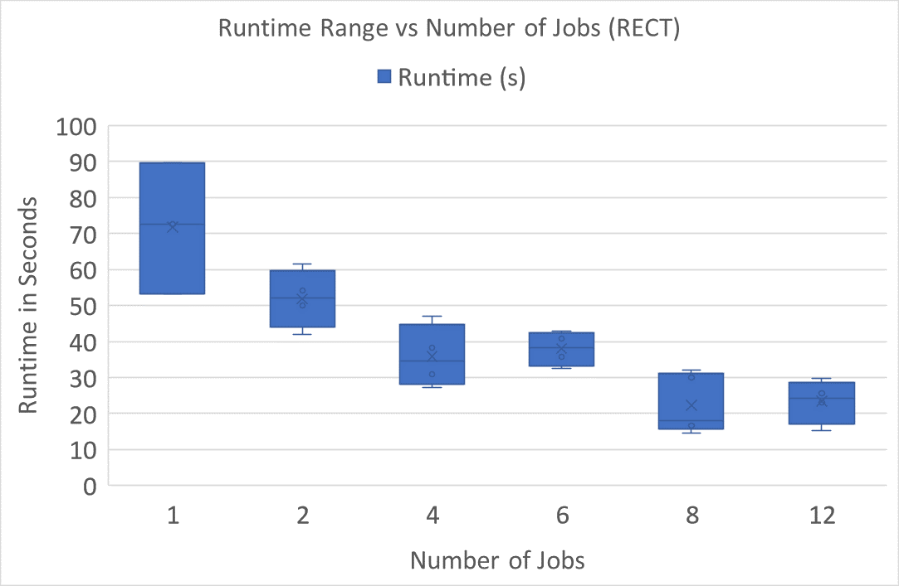

# Parallel Computing in Oracle PL/SQL

Oracle PL/SQL has the ability to perform some work in parallel.  Does this mean it could be a good language for parallel computing? **Probably not**, but let's find out anyway.

## Introduction and Motivation

You know how when you're in school and taking a bunch of classes and you've had too much coffee and you're procrastinating on other work and you start to overthink things and try to combine ideas from multiple courses together?  Perhaps that's a bit too specific of a situation...

Regardless, when I was enrolled in an introductory DBMS course and a course on high performance (parallel) computing, that's exactly the situation I found myself in one morning.  I thought 'Wouldn't it be interesting if I could combine these two courses to use a database server for parallel computing... HPC-SQL!'

I knew it was ridiculous and would probably have horrible performance since most of the queries in my database course took forever to run anyway, but a morbid curiosity took over and I just had to see how bad it would be... and if the load of my demands would crush my class's poor old Oracle server.

## The Problem to Compute

I had my choice of a few problems I already knew how to parallelize easily, and since I didn't want to spend too much time writing this code, I wanted to pick an easy one.  I also knew that something that requires a lot of data to be stored in the database would be terribly slow since I knew the simple queries I had to write in my DBMS course still took quite a long time... let alone trying to do it hundreds or even thousands of times.

I settled on the problem of computing Riemann sums, which will be abbreviated in the code as the RECT problem (because it calculates rectangular areas). Specifically, the code estimates this integral with 8,388,600 individual rectangles:

dx%24)

*Yes, I know this is just ) but the code is general enough to work on any equation that can be calculated in PL/SQL, this one is  just easier to test*


## Algorithm
My strategy for computation is basically splitting up the range of the integral into equal-sized chunks, one for each 'thread' I would be creating.  

Each thread calculates its portion of the area under the curve, then stores the result.

After all threads complete, the partial results are summed up to calculate the correct result


## The Dreaded Code Itself

The code is quite compact, using only a few procedures, tables, and one trigger.  It's not as clean as it could be, but if I touch this code any more, the exposure could become toxic so I'm sharing it as-is.

### Tables

There are 3 tables I use

1. `rect_params` - Contains the parameters that will be used to determine how to run the program in parallel, specifically, it details:

    - The number of threads to create

    - The start and end limits of the integral

    - The number of steps / rectangles to use in estimating the area

2. `rect_partial_values` - As each thread finishes calculating its portion of the area, it stores it in this table, alongside which thread is adding it (for debugging purposes)
    
3. `rect_results` - Stores the overall result (SUM of the partial values) when all threads are finished along with the timestamp of the completion

    - When the algorithm is first started, the timestamp of the start is also inserted into this table, thus allowing for easy calulation of the total computation time: MAX(timestamp) - MIN(timestamp)

### Procedures

1. `run_rect` - This is the procedure the user actually calls to start the computation.  It performs the following actions: 
    1. Selects the parameters from the `rect_params` table
    
    2. Inserts the start timestamp into the `rect_results` table
    
    3. Loops over the number of threads to create, then for each thread, calls `dbms_job.submit` to have each thread call the procedure `partial_rect`

2. `partial_rect` - This procedure performs the actual work calculating Riemann sums.  It uses its thread number (rank) to determine which chunk of the workload to work on.  It's a standard Riemann sum calculation beyond that.  Then, the partial sum is inserted into `rect_partial_values` table, which triggers the `rect_completed` [trigger to check for completion.](#the-trigger-rect_completed)

3. `calc_runtime` -  This is the way for the user to check whether the work is done, and if so, calculate the total runtime.  

    - While the algorithm is running, the user can call this procedure, and check their `DBMS_OUTPUT`.  A message will be printed that says `Runtime cannot be calculated yet`.

    - Once complete, calling this function again will calculate the runtime by selecting the start and end times of the most recent run of the `run_rect` procedure and output it to `DBMS_OUTPUT`.

#### The Trigger: `rect_completed`

After every insert on the `rect_partial_values` table, this trigger runs.  It gets the number of threads that need to run from the `rect_params` table, then compared it against the number of partial solutions in the `rect_partial_values` table.  If every thread has inserted its partial result, it sums up those results to get the final answer, inserts it into `rect_results` alongside the current timestamp, then clears the `rect_partial_values` table for next time.  If not all of the threads have completed, this trigger does nothing.

## Opening Pandora's Box: How to Run the Code

On the off-chance you have failed to heed my warnings and actually want to run this code (the 'cool-factor' does seem tempting), here's how you do it:

1. On a compatible Oracle server, run all of the SQL commands in `riemann_sum_problem.sql` except for the last two instructions.  Those will actually start the computation, so beware.

2. To start the computation, run only once (multiple simulaneous runs will cause data corruption)
    - ```sql
        call run_rect();
        ```
3. Wait until you think the program has completed (it takes a matter of minutes sometimes!), or check whether the trigger has done its insert into `rect_results`

4. Once you think the computation is finished, run the following command.  If the program has not actually finished, an error will be printed.

    - ```sql
        call calc_runtime();
        ```
The result will be printed to `DBMS_OUTPUT`.

### Error Handling

This code certainly could have problems, hang, or get otherwise stuck.  If that happens, just rerun the commands in the SQL file to drop and recreate all the tables and procedures.  Hopefully that should stop any stuck jobs and cause them to safely error out.  If that still doesn't help, you might have to restart your Oracle server.  I never ran into any problems that large, but I really have no idea what this code might do.

## Performance Results

Performance is surprisingly terrible

*(see `RECT SQL times.xlsx` for raw timing data)*



The best performance I could get out of this code used 12 separate jobs, which I approximate to be equal to a thread, though I can't guarantee how Oracle will handle them.

These 12 threads achieved an average performance of around 25 seconds total to complete the computation.  As a comparison, the single threaded average runtime was close to 72 seconds.  This achieves a speedup of: 


What this proves is that is *is* possible to perform work *in Oracle PL/SQL* faster in parallel than it is to do it in serial.

One thing this graph does **not** show is the time it takes to do this computation in a different language, and that is where this truly becomes pathetic.  On the exact same machine, running the same algorithm in *serial* in C  completes the same work in about **1 second**.  So, the PL/SQL, at its peak performance across multiple threads, takes 25 times longer to complete the work, and with a lot more headaches.  

From a performance standpoint, this proof-of-concept work shows the abysmal runtimes of anything in PL/SQL compared to doing the same work in a different environment


## Conculsion

While the performance is terrible, I can't say I expected anything different.  I knew it would be bad, I just wanted numbers to know *how* bad it would be.  

It was still very interesting to discover that parallel computing speedups are possible in Oracle PL/SQL, and that they can be quite significant.  If there was some terrible reason I needed to do a lot of computation in PL/SQL, this certainly would be a way to speed it up, and I think that's the one positive takeaway from this whole experience.

Thinking about it, running this type of code on a DBMS does present a few limited advantages:

- Because of the ACID properties of Oracle, my partial results *were* permanently stored, so if my computation were to be interrupted, I would be able to have confidence in the work that had at least been completed prior.  It would be possible to alter the code so the work could resume from an interruption based on the committed results.

- My results and timing data were also safely stored in the database, and if I had a lot of results, I would be able to easily query them for analysis.

- Often, a database is already setup for storing the data of a research project or experiment, so if code like this were to be used to do work with such data, the raw data would be easily accessible and not require any additional server to be setup to do the computation

    - Of course, there's the caveat that this would slow the database server to a crawl and possibly cause problems for other users of the database

- This parallel computation could be attached to a trigger to automatically compute something based on new data added to a table (It's possible to add support for concurrency by also utilizing a job id with each parallel computation)

- The parallel computation is still faster than doing it in a single thread in Oracle, so if I were already doing some parallelizable work in the DBMS, I could use code like this to possibly increase performance

Honestly, now I've kind-of talked myself into thinking there are some, very limited, possible uses for this work, but I just have to remind myself of how terrible the performance is and realize that any other more traditional method of doing the same thing would be much faster and avoid all the problems that could come with trying to use a DBMS to **do something it was never intended to**.

## Future Work

None! I don't ever want to touch this again and I don't think anyone should either `:^)`
